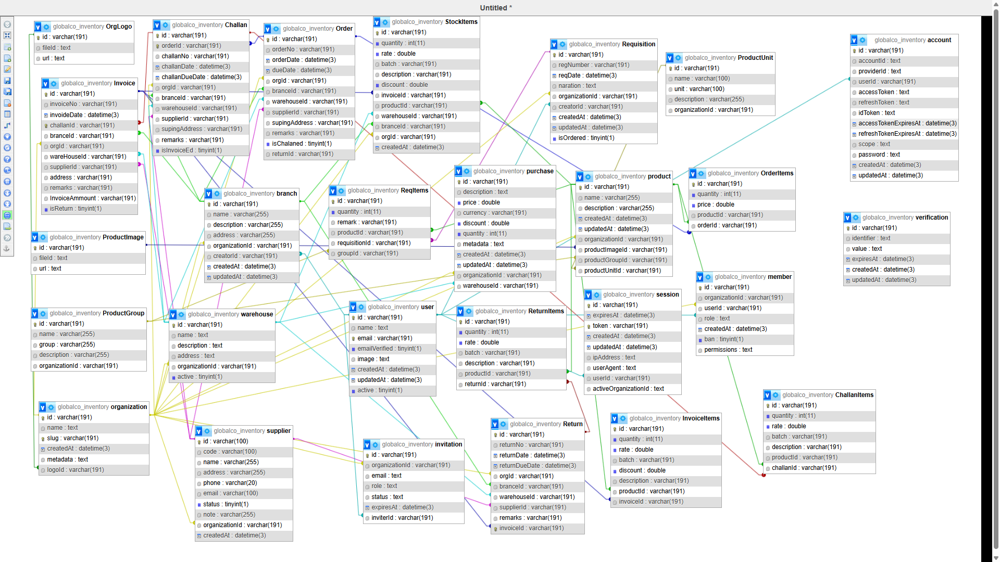

# GCO Inventory Management System

A powerful, full-stack inventory management solution built with modern technologies, focusing on performance and scalability.



## 🚀 Tech Stack

- **Frontend:** Next.js 15 (App Directory)
- **UI Components:** shadcn/ui + Tailwind CSS
- **Database:** MySQL
- **ORM:** Prisma
- **Authentication:** Better Auth
- **Caching:** Custom implementation with 80% query reduction

## ✨ Key Features

- **Multi-organization Support**
- **Real-time Inventory Tracking**
- **Advanced Caching System**
- **Role-based Access Control**
- **SEO Optimized Pages**
- **Responsive Design**
- **Image Optimization with Placeholders**

## 💡 Performance Optimizations

### Caching Strategy
- Custom secondary storage implementation
- Reduced database queries by 80%
- Optimized session management
- Intelligent cache invalidation

### Image Optimization
- Automatic image resizing
- Blur placeholders
- Lazy loading
- WebP format conversion

### SEO Optimizations
- Server-side rendering
- Dynamic meta tags
- Structured data
- Optimized routing

## 🏗 Database Structure

The system uses a complex relational database design (see diagram above) featuring:
- Multi-tenant architecture
- Hierarchical inventory categories
- Transaction history
- User management
- Role-based permissions

## 🔧 Setup & Installation

```bash
# Clone the repository
git clone https://github.com/yourusername/gco-inventory.git

# Install dependencies
npm install

# Setup environment variables
cp .env.example .env.local

# Run database migrations
npx prisma migrate dev

# Start development server
npm run dev
```

## 🎯 Performance Metrics

- **Page Load Time:** < 1.5s
- **First Contentful Paint:** < 0.8s
- **Time to Interactive:** < 2s
- **Database Query Reduction:** 80%
- **Lighthouse Score:** 95+ (Performance, SEO)

## 🔒 Security Features

- JWT-based authentication
- Role-based access control
- Input sanitization
- CSRF protection
- Rate limiting
- Secure cookie handling

## 🌐 Environment Variables

```env
DATABASE_URL='***'
BETTER_AUTH_SECRET='**'
NEXT_PUBLIC_APP_URL='http://localhost:3000'
```

## 📱 Responsive Design

The application is fully responsive and tested across:
- Desktop (1920px+)
- Laptop (1366px+)
- Tablet (768px+)
- Mobile (320px+)

## 📈 Future Improvements

- [ ] Real-time notifications
- [ ] Advanced reporting
- [ ] Barcode scanning
- [ ] Mobile app integration
- [ ] API documentation
